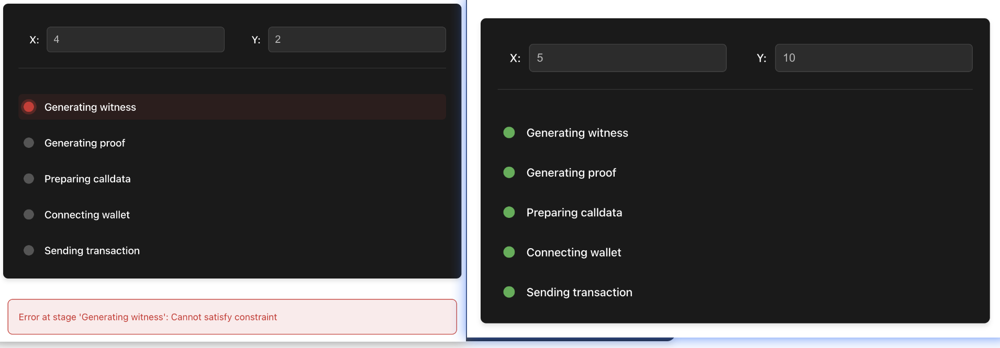

# Task5: 实现 x!=y 的 2 次方证明并在 Testnet 完成这一简单证明，提交 GitHub 链接，链接内包含实现的代码

## 修改 Noir 代码

circuit/src/main.nr

```
fn main(x: Field, y: pub Field) {
    assert(x != y * y);
}
```

## 编译 Noir 电路

```
cd circuit && nargo build
```

## 执行电路生成见证

```
cd circuit && nargo execute witness
[circuit] Circuit witness successfully solved
[circuit] Witness saved to target/witness.gz
```

## 生成验证密钥

```
bb write_vk --scheme ultra_honk --oracle_hash starknet -b ./circuit/target/circuit.json -o ./circuit/target
Scheme is: ultra_honk, num threads: 12
VK saved to "./circuit/target/vk"
```

## 新开 terminal 启动 Python 虚拟环境 使用 Garaga 在 Cairo 生成验证者合约

```
cd contracts && garaga gen --system ultra_starknet_honk --vk ../circuit/target/vk --project-name verifier
⠦ Generating Smart Contract project for ProofSystem.UltraStarknetHonk using vk...
Done!
Smart Contract project created:
/starknet-scaffold-garaga/contracts/verifier/
├── .tool-versions
├── Scarb.lock
├── Scarb.toml
└── src/
    ├── honk_verifier.cairo
    ├── honk_verifier_circuits.cairo
    ├── honk_verifier_constants.cairo
    └── lib.cairo
```

## 创建账号并部署

```bash
sncast account create \
	--network sepolia \
	--name 0xpest

sncast account deploy \
    --network sepolia \
    --name 0xpest
```

## 声明合约代码

```
sncast declare --contract-name UltraStarknetHonkVerifier --url https://starknet-sepolia.public.blastapi.io/rpc/v0_8
```

## 部署验证器

```
sncast deploy --salt 0xaa --class-hash 0x004d13e14caa3b225b07595e7edcade77ce849e30ee7908bf4b2e4446d652ebf --url https://starknet-sepolia.public.blastapi.io/rpc/v0_8
command: deploy
contract_address: 0x029ab70A7aBAeA8271919D7B7ee16320e9027A1552f0276742D03B507b10B59c
transaction_hash: 0x4018385beb13172aacfb933dc781f9c3bf384d0cba14a0c53d274c822c00c4c

To see deployment details, visit:
contract: https://sepolia.starkscan.co/contract/0x029ab70A7aBAeA8271919D7B7ee16320e9027A1552f0276742D03B507b10B59c
transaction: https://sepolia.starkscan.co/tx/0x4018385beb13172aacfb933dc781f9c3bf384d0cba14a0c53d274c822c00c4c
```

## 修改前端文件代码

```
cp ./circuit/target/circuit.json ./app/src/assets/circuit.json
cp ./circuit/target/vk ./app/src/assets/vk.bin
cp ./contracts/target/release/verifier_UltraStarknetHonkVerifier.contract_class.json ./app/src/assets/verifier.json

# /app/src/App.tsx

const provider = new RpcProvider({
  nodeUrl: "https://starknet-sepolia.public.blastapi.io/rpc/v0_8",
});
// TODO: use conract address from the result of the `make deploy-verifier` step
const contractAddress =
  "0x029ab70a7abaea8271919d7b7ee16320e9027a1552f0276742d03b507b10b59c";
```

## 启动前端

```
yarn dev
```

## 前端页面


